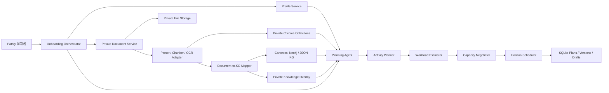

# Pathly Onboarding V2 与用户私有文档改造方案

## 1. 文档目标

本方案把三项正在演进的能力合并为一条完整产品链路：

1. 认知—情感双维度学习者画像；
2. 用户自行上传学习文档，并将其用于目标理解、计划生成、内容生成与答疑；
3. 先估算达到目标所需的总学习时间，再根据用户自定义天数与每日可用时间进行容量协商和排期。

本方案是当前 Milestone 2 Stage 4.1 的后续总实施计划。Stage 4.1 已完成“概念路径和概念学习时间的初步估算”，但仍标记为 `concept_path_only`、`is_final=false`。在活动层、文档工作量和最终可行性逻辑完成前，不应把当前估算展示成完整达标时间。

每个实施阶段都必须遵循现有确认机制：完成代码与测试，更新 `LOG.md`，向用户汇报，停止并等待明确确认，不连续实施下一阶段。

## 2. 产品原则与边界

### 2.1 画像、目标与时间必须分层

Pathly 不应继续把所有信息写入一份会被新目标覆盖的 Profile。

- `LearnerProfile`：跨学习路径复用、变化较慢的长期画像。
- `LearningPathContext`：某一次学习目标专属的范围、时间、目标知识与偏好覆盖。
- `ProfileSnapshot`：计划生成当时所使用的画像快照，保证旧路径可解释和可复现。
- `LearningState`：随着学习、Quiz 和 Adaptation 持续变化的掌握度、信心与困难。

其中：

- `daily_time_minutes` 是当前路径的容量约束，不属于情感偏好。
- `prior_domain_knowledge` 不能只保留一个全局分数，应拆为通用基础与当前目标的 `mastery_vector`。
- `interest_domain`、`learning_style`、`pace_preference` 可作为长期默认值，但允许每条路径覆盖。
- 动机、信心、焦虑会随目标和阶段变化，应保留长期基线和当前路径状态。

### 2.2 用户上传文档是私有学习来源，不是全局 KG

8501 的职责保持不变：由开发者或知识管理员上传权威 PDF，构建并校准全局 KG 和公共 RAG。

Pathly 的新上传入口属于学习者侧：

- 文档默认仅当前用户可见；
- 文档进入私有文件库、私有 chunk 索引和私有知识覆盖层；
- 从文档识别出的概念优先映射到全局 canonical KG；
- 无法可靠映射的概念保留为 `private_concept_candidate`，不得自动写入全局 Neo4j；
- 用户上传某份材料不等于已经掌握材料内容；
- 删除文档时同时删除其私有文件、索引、映射和路径关联，不影响全局 KG。

### 2.3 文档与工作量不能重复计时

文档首先是讲义、检索和引用来源，不应把“概念学习时间”和“阅读同一概念对应文档的时间”无条件相加。

只有以下情况才把文档阅读计为独立强制工作量：

- 用户目标明确为读完该文档；
- 用户指定必须完成的章节、页码或讲义范围；
- 考试、作业或项目要求覆盖指定材料；
- 文档中存在全局 KG 未覆盖、但用户明确要求学习的私有概念。

最终总时间模型为：

`概念学习 + 必读材料 + 示例/练习 + 复习 + 测验 + 项目/产出 + 反思`

同一概念、重复文档和重复章节必须先去重，再计算总时间。

## 3. 完整 Onboarding 链路

Onboarding 采用单页分阶段工作区。左侧为对话与操作，右侧持续显示四个可切换面板：学习者画像、我的学习资料、目标与概念路径、工作量与可行性。

文档解析可以在后台进行，用户无需停在加载页，可以同时回答画像问题。

### Step 0：识别首次或再次 Onboarding

系统先读取用户现有画像、文档库和学习路径。

首次用户：

- 完成长版画像采集；
- 建立长期认知与情感基线；
- 预计 8–12 个简短问题。

再次创建学习路径：

- 默认沿用已确认的长期画像；
- 仅询问信息是否变化、当前目标基础、时间约束和偏好覆盖；
- 预计 3–6 个问题；
- 用户可随时展开修改长期画像；
- 新目标创建独立 `path_id`，不覆盖旧路径。

### Step 1：描述目标并选择学习来源

用户可用自然语言描述目标、上传一份或多份自己的文档，或两者同时进行。

需要询问：

- 你最终希望能做到什么？
- 是否有考试、作业、项目、证书或具体产出？
- 上传材料是必须覆盖的课程材料，还是可选参考资料？

文档首版范围以现有解析能力为基础：

- 第一阶段正式支持文字型 PDF；
- 扫描型 PDF 显示“需要 OCR”状态，后续阶段接入 OCR fallback；
- DOCX、PPTX、TXT、Markdown 在解析适配器稳定后逐项开放，不在 UI 提前承诺。

### Step 2：文档解析与学习范围确认

上传后展示逐文件状态：

`上传中 → 解析中 → 已切块 → 概念映射中 → 可用于规划`

用户需要确认：

- 学整份文档，还是指定章节/页码；
- 文档用途：核心教材、补充资料、考试范围、作业说明或项目资料；
- 是否只使用自己的资料；
- 是否允许 Pathly 使用全局 KG 补足先修知识；
- 是否允许推荐外部公共资源。

默认提供三种来源模式：

1. `private_plus_kg`：我的资料为主，全局 KG 补足先修知识；
2. `private_only`：只使用我的资料，缺失内容明确提示；
3. `kg_only`：本路径不使用上传材料。

系统返回一个可编辑的“目标解释草案”：

- 核心目标；
- 必须覆盖的文档与章节；
- 映射成功的 canonical concepts；
- 私有概念候选；
- 被忽略的目录、参考文献或重复内容；
- 覆盖缺口与低置信映射。

低置信映射必须由用户确认，不能直接进入 Planning。

### Step 3：采集或复用认知画像

认知维度保留 1–5 的标准化结果，但不直接要求用户给自己打分。使用情境式问题推断：

- `mathematical_ability`
- `programming_ability`
- `abstract_thinking`
- `logical_reasoning`
- `general_learning_foundation`
- 当前目标专属的 `mastery_vector`
- 已掌握、听说过、未接触的目标概念

每个推断字段保存 `value`、`confidence`、`reason`、`evidence_source` 和 `updated_at`。

再次 Onboarding 不重复询问稳定能力，只进行目标相关的微诊断。例如，用户已有 Python 基础，但新目标是 RAG，系统只需要确认 embedding、检索和 LLM 的掌握情况。

上传文档只能提供“目标范围证据”，不能作为用户掌握度证据。只有用户回答、诊断题和历史学习表现可以改变 mastery。

### Step 4：采集或覆盖情感与学习偏好

长期默认偏好包括：

- `learning_style`：视觉、案例、理论、动手或混合；
- `preferred_examples`：生活、业务、科研、代码、数学等；
- `pace_preference`：密集、稳步、灵活；
- `interest_tags`；
- `motivation_baseline`
- `confidence_baseline`
- `anxiety_baseline`
- `self_regulation`

当前路径可覆盖这次更希望理论、代码、项目还是考试训练，是否接受外部资源，是否需要更多复习和低压力测验，以及当前信心、焦虑和动机。

右侧画像卡需要明确区分：已确认信息、系统推断信息、本路径临时覆盖、低置信度且建议确认的信息。

### Step 5：生成最终工作量估算

当目标、文档范围和画像足够明确后，Planning 依次执行：

1. 目标解释；
2. 文档范围解析；
3. canonical KG 映射与先修路径；
4. 私有概念覆盖层合并；
5. 概念拆分；
6. 偏好感知的学习活动生成；
7. 文档阅读与活动去重；
8. 最终工作量计算。

页面先展示“达到目标预计需要多少时间”，再询问完成天数：

- 总预计分钟/小时；
- 概念、阅读、练习、复习、Quiz、项目的时间构成；
- 时间来自 KG 元数据、文档页数/字数、规则模板或模型估算；
- 估算置信度；
- KG 或文档覆盖警告；
- 对画像和偏好的具体应用说明。

只有完成活动层后，返回 `estimate_is_final=true`。在此之前只能显示“初步概念学习时间”，不得用于最终可行性承诺。

### Step 6：用户设定任意天数或截止日期

用户可以输入当前支持范围内的任意天数，而不是固定 7/14/30 天；也可以选择截止日期。

- `recommended_daily_minutes = ceil(total_required_minutes / requested_days)`
- `available_capacity_minutes = requested_days × max_available_daily_minutes`
- `capacity_gap_minutes = available_capacity_minutes - total_required_minutes`
- `minimum_recommended_days = ceil(total_required_minutes / max_available_daily_minutes)`

先告诉用户“如果按 N 天完成，平均每天建议学习 M 分钟”，再询问或确认“你每天最多能稳定投入多少时间”。

### Step 7：可行性协商

根据容量显示四级状态，但始终展示精确分钟差额：

- `comfortable`：容量充足，可选择稳步巩固或提前完成；
- `feasible`：基本可行；
- `tight`：可行但缓冲不足；
- `insufficient`：按当前范围无法完成。

容量不足时提供延长天数、增加每日可用时间、缩小学习范围、调整最终产出或保存草稿。

“缩小范围”必须生成独立的部分目标草案，列出被移除或延后的内容及影响，并由用户明确确认。系统不得为了适配时间静默丢弃概念。

容量过剩时提供：

- `paced_consolidation`：保留用户天数，增加有意义的练习、复习和项目里程碑；
- `early_completion`：使用更短的诚实完成周期。

### Step 8：最终确认并生成路径

确认页包含目标和预期成果、使用的文档及章节、来源模式和外部资源权限、路径专属基础与偏好、总工作量及构成、目标天数、每日建议时间与每日最大可用时间、可行性状态与用户选择、将跳过/压缩/加强/补强的内容，以及所有低置信映射和覆盖警告。

用户确认后才创建 `path_id` 和 plan v1。退出或刷新前的内容保存为 onboarding draft，可以恢复、编辑或删除。

## 4. 页面与交互改造

### 4.1 Onboarding Workspace

- 顶部阶段进度；
- 文档拖拽/选择区域；
- 多文档队列和后台状态；
- 目标解释确认卡；
- 概念与文档范围编辑器；
- 工作量构成图；
- 可行性协商卡；
- 返回旧路径、保存草稿和放弃草稿入口。

### 4.2 我的资料库

- 上传、查看、重命名、删除和重新解析；
- 显示文件类型、页数、解析状态、索引状态和被哪些路径使用；
- 查看提取章节和概念映射；
- 修正文件用途与可用范围；
- 明确显示“私有资料，不会自动进入公共知识图谱”。

### 4.3 工作台与今日学习

路径地图区分全局 KG canonical node、文档支持的 canonical node、仅存在于私有覆盖层的概念、低覆盖或待确认节点。

每日内容和 Chat 引用标注文档名与页码/章节、公共资源、KG reasoning，以及 live/cached/fallback 模式。

## 5. 数据架构

### 5.1 LearnerProfileV2

- `user_id`
- `basic_info`
- `cognitive_traits`
- `affective_defaults`
- `known_topics`
- `mastery_vector`
- `inference_records`
- `profile_version`
- `created_at`
- `updated_at`

旧 Profile 字段采用增量迁移，不清空现有数据。

### 5.2 LearningPathContext

- `path_id`
- `user_id`
- `goal_text`
- `outcome_type`
- `target_concepts`
- `target_mastery`
- `target_days`
- `deadline`
- `max_daily_minutes`
- `source_mode`
- `preference_overrides`
- `current_affective_state`
- `profile_snapshot`
- `status`

### 5.3 UserDocument

- `document_id`
- `user_id`
- `display_name`
- `file_type`
- `storage_key`
- `sha256`
- `size_bytes`
- `page_count`
- `language`
- `privacy_scope`
- `parse_status`
- `index_status`
- `created_at`
- `deleted_at`

### 5.4 DocumentIngestionJob

- `job_id`
- `document_id`
- `stage`
- `progress`
- `mode`
- `error_code`
- `retryable`
- `started_at`
- `completed_at`

### 5.5 DocumentChunk

- `chunk_id`
- `document_id`
- `user_id`
- `page_start`
- `page_end`
- `section_path`
- `text`
- `token_count`
- `embedding_id`
- `content_hash`

### 5.6 DocumentConceptEvidence

- `evidence_id`
- `document_id`
- `chunk_ids`
- `canonical_concept_id`
- `private_concept_id`
- `mapping_confidence`
- `mapping_reason`
- `mapping_status`
- `estimated_reading_minutes`

### 5.7 PathDocumentLink

- `path_id`
- `document_id`
- `role`
- `required`
- `included_sections`
- `excluded_sections`
- `source_priority`

### 5.8 WorkloadEstimate

- `estimate_id`
- `path_id`
- `schema_version`
- `concept_minutes`
- `required_reading_minutes`
- `practice_minutes`
- `review_minutes`
- `assessment_minutes`
- `project_minutes`
- `reflection_minutes`
- `total_required_minutes`
- `estimate_confidence`
- `estimate_sources`
- `coverage_warnings`
- `is_final`

### 5.9 FeasibilityDecision

- `decision_id`
- `path_id`
- `requested_days`
- `recommended_daily_minutes`
- `max_available_daily_minutes`
- `available_capacity_minutes`
- `capacity_gap_minutes`
- `status`
- `selected_strategy`
- `scope_change_draft`
- `user_confirmed_at`

## 6. 系统架构与数据流

存储分工：

- SQLite：用户画像、文档元数据、路径关联、草稿、估算、决策和计划版本；
- 私有文件存储：原始用户文件，使用不可猜测 storage key；
- ChromaDB：按用户隔离的文档 chunk embedding；
- Neo4j：权威 canonical KG，仅由 8501 管理流程更新；
- JSON KG：Neo4j 不可用时的校准 fallback；
- 私有知识覆盖层：文档概念与 canonical KG 的映射及未映射概念，不写入全局 KG。

## 7. API 规划

### Profile 与 Onboarding Draft

- `GET /api/profiles/{user_id}`
- `PATCH /api/profiles/{user_id}`
- `POST /api/onboarding-drafts`
- `GET /api/onboarding-drafts/{draft_id}`
- `PATCH /api/onboarding-drafts/{draft_id}`
- `DELETE /api/onboarding-drafts/{draft_id}`

### 私有文档

- `POST /api/documents`
- `GET /api/users/{user_id}/documents`
- `GET /api/documents/{document_id}`
- `GET /api/documents/{document_id}/status`
- `PATCH /api/documents/{document_id}`
- `PATCH /api/documents/{document_id}/scope`
- `POST /api/documents/{document_id}/retry`
- `DELETE /api/documents/{document_id}`

### 目标、映射和估算

- `POST /api/goal-interpretations`
- `POST /api/goal-interpretations/{id}/confirm`
- `POST /api/workload-estimates`
- `GET /api/workload-estimates/{estimate_id}`
- `POST /api/feasibility-decisions`
- `PATCH /api/feasibility-decisions/{decision_id}`

### Planning

沿用现有 Profile 与 Plan API，并扩展 `POST /api/plans` 接收 `path_context`、`document_links`、`confirmed_mappings`、`workload_estimate_id` 和 `feasibility_decision_id`。

服务器端校验所有 document_id 都属于当前 user_id，不能相信前端传入的存储路径或 Chroma collection 名称。

## 8. 新的分阶段实施方案

### Stage O0：契约、边界与兼容迁移

目标：先稳定长期画像、路径上下文和私有文档的数据边界。

实施：

- 定义 `LearnerProfileV2`、`LearningPathContext`、`UserDocument`、`PathDocumentLink`、`WorkloadEstimate`；
- 将 `daily_minutes` 从长期偏好语义中迁移为路径容量约束；
- 保留旧字段读取兼容并建立增量 SQLite migration；
- 给现有 plan 保存 `profile_snapshot`；
- 明确 8501 全局 KG 上传和 Pathly 私有上传的代码与数据边界。

验收：

- 旧用户、旧路径和 v1/v2 plan 仍能读取；
- 同一用户可拥有多条路径和多份文档；
- 更新新目标不会覆盖长期画像或旧路径；
- 当前 Stage 4.1 输出继续兼容。

完成后更新 `LOG.md`，暂停等待确认。

### Stage O1：私有 PDF 上传与异步解析

目标：让 Pathly 用户上传自己的 PDF，并安全进入私有资料库。

实施：

- 实现上传、文件校验、hash 去重、私有存储和元数据 API；
- 复用现有 PDF 解析和 adaptive chunking 能力，封装为非 Streamlit 服务；
- 建立异步 ingestion job 与可轮询状态；
- 按 `user_id/document_id` 隔离 Chroma 数据；
- 实现删除、失败重试和残留索引清理；
- 扫描 PDF 返回明确的 OCR-required 状态，不能伪装解析成功。

验收：

- 两个用户无法读取或检索彼此文档；
- 重复上传不会产生重复 chunk；
- 解析失败不阻断 Onboarding，可更换文件或继续用 KG；
- 删除后原始文件、chunk 和路径引用被安全处理；
- 8501 和全局 `kg_chunks` 不被修改。

完成后更新 `LOG.md`，暂停等待确认。

### Stage O2：文档范围、目标解释与私有知识覆盖层

目标：让用户确认“学什么”和“文档如何参与”，而不是上传后直接规划。

实施：

- 从 chunk 中识别候选概念并映射 canonical KG；
- 建立 `DocumentConceptEvidence` 和 private concept candidate；
- 实现整份/章节/页码范围选择；
- 实现 `private_plus_kg / private_only / kg_only`；
- 显示映射置信度、来源、缺口和重复内容；
- 低置信映射进入用户确认，不写入全局 Neo4j。

验收：

- 同一目标切换来源模式会产生可解释的覆盖变化；
- 用户可以排除无关章节；
- 私有概念存在时仍可继续形成草案，但带明确 warning；
- 上传资料不会被误写成用户已掌握知识；
- 全局 KG 节点数量不因用户上传变化。

完成后更新 `LOG.md`，暂停等待确认。

### Stage O3：认知—情感画像 V2 与重复 Onboarding

目标：实现首次完整采集、再次复用与目标微诊断。

实施：

- 将情境式答案转换为带 confidence/reason/source 的画像推断；
- 增加认知五维、情感基线和当前路径状态；
- 为目标 concepts 生成 mastery 微诊断；
- 实现用户直接修改推断结果；
- 首次与再次 Onboarding 使用不同问题集；
- 保存 draft，刷新或错误后可恢复。

验收：

- 首次用户形成完整画像摘要；
- 再次创建路径不重复询问稳定信息；
- 用户修改推断后，Planning 使用确认值；
- 相同目标但不同基础会改变所需概念和时间；
- 相同基础但不同偏好不改变 canonical 路径，只改变活动组合。

完成后更新 `LOG.md`，暂停等待确认。

### Stage O4：最终活动工作量模型

目标：承接当前 Stage 4.2，使“总时间”包含真正达到目标所需的全部活动。

实施：

- 实现 ActivityPlanner；
- 生成讲解、示例、练习、代码、复习、Quiz、项目和反思活动；
- 根据认知基础、情感状态和路径偏好调整活动比例；
- 把用户指定的必读文档转为引用明确的阅读活动；
- 对概念学习、阅读和重复文档进行去重；
- 输出 final WorkloadEstimate 与时间来源。

验收：

- `is_final=true` 仅在所有必需活动完成估算后出现；
- 更换天数不会改变达标总分钟；
- 更换偏好会改变活动结构与总时间，并有 reason；
- 文档作为参考时不被重复加时，作为必读范围时正确计时；
- LLM 失败时模板活动仍能给出明确标记的完整估算。

完成后更新 `LOG.md`，暂停等待确认。

### Stage O5：容量优先的可行性协商

目标：完成新的 Onboarding 时间逻辑。

实施：

- 支持任意目标天数和截止日期；
- 先展示总时间，再计算推荐每日时间；
- 采集或确认每日最大可用时间；
- 返回 comfortable/feasible/tight/insufficient 和精确差额；
- 支持延长天数、增加每日时间、缩小范围、paced consolidation 和 early completion；
- 范围缩减生成独立草案，必须用户确认；
- 最终确认后才创建 plan v1。

验收：

- 1000 分钟、10 天得到 100 分钟/天；
- 若每天最多 60 分钟，显示缺口 400 分钟和至少 17 天；
- 用户可以输入 30 天以内任意天数，而非固定选项；
- 拒绝范围缩减时原目标不变；
- 未确认时不会保存成正式路径。

完成后更新 `LOG.md`，暂停等待确认。

### Stage O6：全周期活动排程

目标：承接当前 Stage 4.3，把最终活动分配到用户确认的学习周期。

实施：

- 按活动级别排程并保持先修顺序；
- 支持 +1、+3、+7、+14 的间隔复习；
- 安排 Quiz、项目里程碑与反思；
- paced consolidation 下每个计划日都有有意义活动；
- 每日不超过已确认容量；
- 容量不足时保留 unscheduled activities，不静默删除。

验收：

- 任意已确认天数都能生成符合容量的时间线；
- 没有 0 分钟 padding day；
- 复习发生在首次学习之后；
- 重排不改变 canonical concept path；
- 相同输入在 fallback 模式下结果可复现。

完成后更新 `LOG.md`，暂停等待确认。

### Stage O7：Onboarding UI、资料库与路径可视化

目标：承接当前 Stage 4.4，把完整链路落到 Pathly 前端。

实施：

- 上线 Onboarding Workspace 和四个实时侧面板；
- 上线我的资料库和上传状态；
- 展示目标解释、来源范围、画像推断、工作量和可行性协商；
- 路径图显示 canonical/private/document-supported 节点；
- 时间线显示每日活动和时间构成；
- 支持多路径、草稿恢复、错误恢复和窄屏时间线；
- 移除对正式产品无意义的 Demo-only 引导。

验收：

- 首次与再次 Onboarding 均可完整完成；
- 上传解析期间可继续回答问题；
- 刷新后草稿、画像、文档、估算和计划不丢失；
- 错误状态始终可返回修改或回到旧路径；
- 用户能清楚回答“为什么是这些内容、为什么需要这些时间、哪些内容来自我的文档”。

完成后更新 `LOG.md`，暂停等待确认。

### Stage O8：端到端、隐私与降级验收

目标：保证正式产品链路稳定，而不依赖演示开关。

实施：

- 完成文件类型、大小、恶意内容和访问控制校验；
- 补充结构化日志，但不记录完整文档、画像或聊天正文；
- 验证 Neo4j、Chroma、解析器和模型分别不可用时的降级；
- 验证删除、重试、重复上传、并发解析和数据库迁移；
- 完成 5–8 分钟主流程和长文档后台处理流程验收；
- 编写用户文档隐私、支持格式和失败处理说明。

验收：

- 任一外部依赖失败时，用户不会进入白屏或不可返回状态；
- fallback 不冒充实时结果；
- 私有文档无越权读取；
- 删除语义和保留范围符合产品说明；
- Pathly 学习者上传与 8501 管理员构建仍无职责交叉。

完成后更新 `LOG.md`，暂停等待最终确认。

## 9. 推荐实施顺序与当前进度衔接

当前 Stage 4.1 可作为新方案的概念拆分与初步容量计算基础，不需要推倒重做，但它尚未完成最终时间模型。

建议下一步不是直接做原 Stage 4.2，而是：

1. 先执行 Stage O0，修正数据契约；
2. 再执行 O1、O2，使用户文档真正成为可引用的私有来源；
3. 执行 O3，稳定画像复用和目标微诊断；
4. 执行 O4，将原 Stage 4.2 与文档工作量一起完成；
5. 执行 O5，落地新的时间询问和可行性协商；
6. 执行 O6、O7，分别完成调度和界面；
7. 最后执行 O8 正式验收。

这样可避免先做一版不含用户文档的活动估算和 Onboarding UI，随后又因数据模型变化而返工。

## 10. 本轮不实施的内容

本轮只形成产品与技术改造方案，不修改现有功能代码、数据库或页面。Stage 4.1 仍保持“待用户确认”，新的实施应从 Stage O0 开始，并继续遵守逐阶段确认机制。
